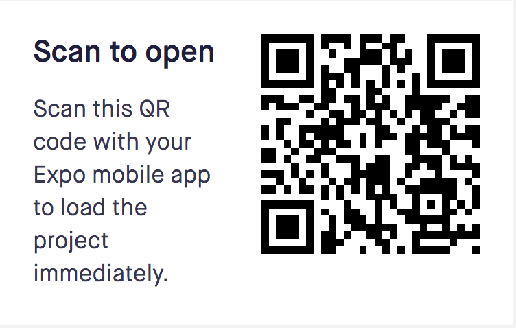

# Twitch Live Streaming App (Frontend Mobile Application)

This Mobile Application will allow users to view Top Live Streams that are streaming on twitch.tv. This application is build using Go and React Native.

## User Stories
1. As a User, I want to see the Top 100 Games that are currently live. Upon selecting the game, I want to see the top 100 streams currently streaming for that game. Upon selecting the game, I want to watch the livestream in my browser.

2. As a User, I want to see the Top 100 Streams. I can then select the stream that I want to watch.


## Getting Started

These instructions will get you a copy of the Front End Mobile View up and running on your local machine for development and testing purposes.

### Prerequisites

What things you need to install the software and how to install them:

 - [Node](https://facebook.github.io/react-native/docs/getting-started.html#installing-dependencies)
 - [Watchman](https://facebook.github.io/watchman/)
 - [The React Native CLI](https://facebook.github.io/react-native/docs/getting-started.html#the-react-native-cli)
 - [React Native](https://facebook.github.io/react-native/docs/getting-started.html)
 - Any Web Browser (Chrome, Edge, Firefox)
 - (Local Setup: MacOS) [Xcode](https://developer.apple.com/xcode/)
 - (Local Setup: Windows) [Android Studio](https://developer.android.com/studio/index.html)
 - (For Mobile Browsing) Install the [Expo](https://expo.io/) App on your Mobile Device

### Installing

Here are the instructions to get the program up and running on the machine. *Do ensure that prerequisites are installed on your machine*

1. Open the terminal and navigate to the "twitch-livestreams/Frontend" Folder
```
$ cd twitch-livestreams
$ cd Frontend
```
1. Get and install dependencies:
```
$ npm install
```
1. Run Mobile Emulator:
  - For macOS users: To setup and run Xcode, follow setup and run instructions from the React Native's documentation for [macOS/iOS](https://facebook.github.io/react-native/docs/getting-started.html#xcode)
  - For WindowsOS users: To setup and run Android Virtual Machine (AVM)on Android Studios, follow the setup instructions from the React Native's documentation for [Windows/Android](https://facebook.github.io/react-native/docs/getting-started.html#installing-dependencies)
1. Map the Emulator's port to the machines port to ensure that the Emulator can communicate with the machine locally.
  - For macPC/iOS Setup:

  - For Windows/Android Setup:
  ```
  $ adb reverse tcp:8080 tcp:8080
  ```
1. Run the project (do ensure that the mobile emulator is up and running on your machine):
```
$ npm run ios (for MacOS)
$ npm run android (for Android)
```
The application will now run on your mobile emulator.

## Running the App on the Web
For users who just want to view the application on the web, it can be done via [snack.expo.io/@danielchengml](https://expo.io/@danielchengml/snack-By5lq6ZYG). All you would need is a mobile device with the [Expo](https://expo.io/) Mobile App Downloaded.

Scan the QR Code from the Expo App on your mobile device.




## Setting up the Back End (API Server) Environment

In order for the front end mobile application to work, the backend web server has to be powered on and serving on `localhost:8080`.

The instructions to deploy the backend server can be found under the folder `twitch-livestreams` > `Backend` > `README.md`

## Built With

* [Visual Studio Code](https://code.visualstudio.com/) - The IDE used
* [React Native 0.54](https://facebook.github.io/react-native/docs/getting-started.html#installing-dependencies) - The Programming Language Used
* [Node](https://expo.io/) - Package Manager
* [Expo SDK](https://expo.io/) - For Developing and publishing the Mobile Application easily

## Versioning

Version 1.0.0

## Authors

* **Daniel Cheng** -  [github.com/danielchengml](https://github.com/danielchengml)

## Acknowledgments

* Tomasz Wiszkowski, Google
* David Chang, ReactJS Developer, Airbnb
* Anbiniyar Muniandy, Full Stack Developer, Microsoft

## Sources: Twitch API (https://dev.twitch.tv/docs/api)

- API for Top-100 Live Streams based on Search Query Viewership:
https://api.twitch.tv/kraken/search/streams?limit=100&client_id={API_KEY}

## Troubleshooting
For troubleshooting errors during the setup and run process, please refer to the documentation [here](https://github.com/react-community/create-react-native-app/blob/master/react-native-scripts/template/README.md) by the React Community.
