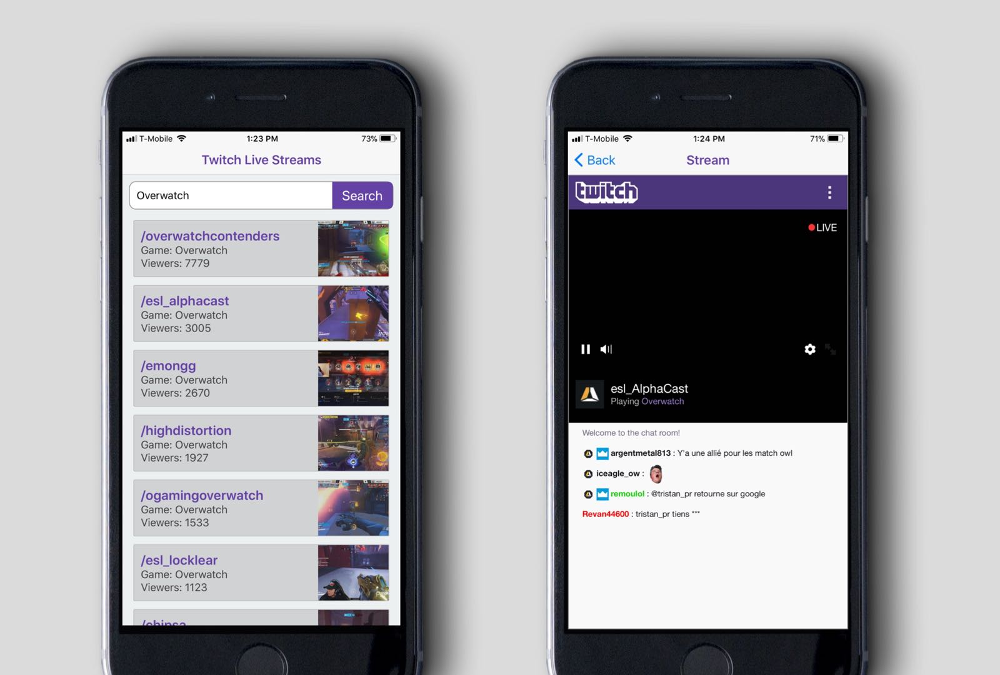

# Twitch Live Streaming App

This Mobile Application will allow users to view Top Live Streams that are streaming on [twitch.tv](https://www.twitch.tv/). This application is build using React Native and a Go API.

## User Stories
1. As a User, I want to search for live creators currently streaming on Twitch.

1. As a User, I want to see a list of streams currently streaming based on my search request.

1. As a User, I want to be able to select a particular live stream and view it immediately.

1. As a User, I want to be able to go back to where I left off and select another stream to watch.

## Getting Started

These instructions will describe the two different components of the project and direct users to setup the respective components.

### Front End Mobile Application
The Front End of this application will allow users to search for live streams on Twitch.tv using a keyword search query. This application was written in React Native which is a popular language for mobile applications.

The Front End will receive information from the Backend through API GET Requests. The server is currently designed to run locally and will serve on `localhost:8080`.

Detailed setup instructions can be found in `twitch-livestreams` > `Frontend` > `README.md`
 or [here](./Frontend/README.md).

 ### Back End API / Server
 The Back End of this application will serve information to the mobile Front End based on the search query. The backend component also acts as a gateway that has the capacity to manage multiple APIs. The current API for this application uses Twitch Developers [API](https://dev.twitch.tv/api).

 The backend of this application was written in [Go](https://golang.org/) which is an extremely fast and robust web server. The Go API will serve and handle request from the front end via a local port ie. `localhost:8080`.

 Detailed setup instructions can be found in `twitch-livestreams` > `Backend` > `README.md`
  or [here](./Backend/README.md).
